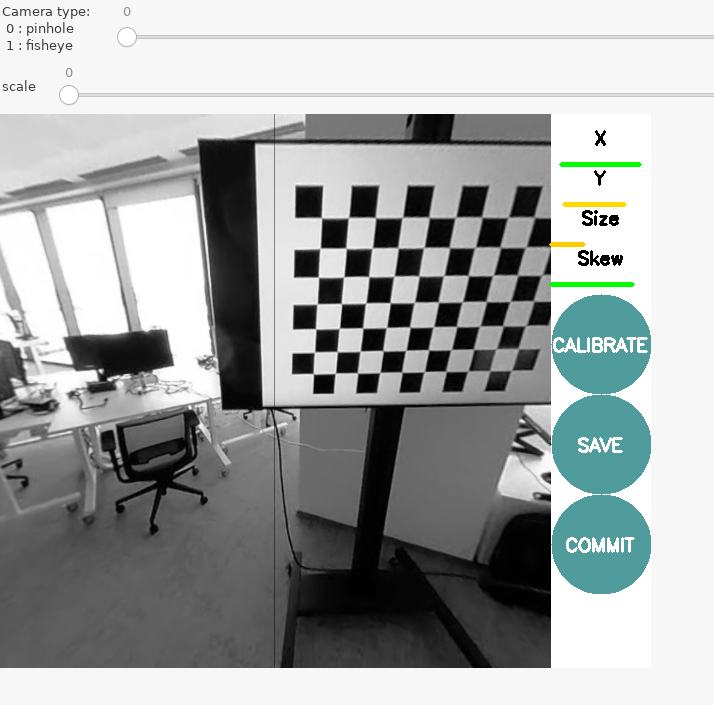

# Canera calibration

## Huawei, Panoramic, Camera CV60, Dual 13 MP

 http://wiki.ros.org/camera_calibration

1. Collect calibration images: To calibrate the camera, you need to
   capture several images of a calibration pattern, such as a
   chessboard or a circle grid. It's important to capture the images
   from different angles and orientations to ensure the calibration is
   accurate.

   FEX: Make short film with checkerboard.

2. Use ROS camera_calibration allows easy calibration of monocular or
   stereo cameras using a checkerboard calibration target.

3. Replay captured sequence to ROS topic:

```shell
./scripts/video_replay2ros_topic.py -i data/PIC_20230504_080209.mp4 -t camera/image_raw/compressed -r 10
```

4. Convert equirect to cubemap and select face to calibrate.

```shell
rosrun camera_split main.py _camera:=back _side:=1024
```
	Input equirect shape (2688, 5376, 3)
	Output cubemap{face} shape (1024, 1024, 3)

5. Running the Calibration Node. To start the calibration you will
   need to load the image topics that will be calibrated:


```shell
rosrun camera_calibration cameracalibrator.py --no-service-check --size 10x7 --square 0.07 image:=/omnicv/back/camera/image_raw camera:=/omnicv/back/camera
```
ROS camera calibration interface:
<p align="center">
  
</p>

Back camera calibration results:

```
....
*** Added sample 65, p_x = 0.852, p_y = 0.335, p_size = 0.308, skew = 0.520
**** Calibrating ****
mono pinhole calibration...
D = [0.04522989264876817, -0.03664851680806835, -0.0018348119122395016, -0.0030928017023695315, 0.0]
K = [504.02153693781884, 0.0, 509.7373164760683, 0.0, 504.82107972813594, 508.73736448029166, 0.0, 0.0, 1.0]
R = [1.0, 0.0, 0.0, 0.0, 1.0, 0.0, 0.0, 0.0, 1.0]
P = [507.43939208984375, 0.0, 504.05383465566774, 0.0, 0.0, 508.3639831542969, 505.0548874215892, 0.0, 0.0, 0.0, 1.0, 0.0]
None
# oST version 5.0 parameters


[image]

width
1024

height
1024

[narrow_stereo]

camera matrix
504.021537 0.000000 509.737316
0.000000 504.821080 508.737364
0.000000 0.000000 1.000000

distortion
0.045230 -0.036649 -0.001835 -0.003093 0.000000

rectification
1.000000 0.000000 0.000000
0.000000 1.000000 0.000000
0.000000 0.000000 1.000000

projection
507.439392 0.000000 504.053835 0.000000
0.000000 508.363983 505.054887 0.000000
0.000000 0.000000 1.000000 0.000000

('Wrote calibration data to', '/tmp/calibrationdata.tar.gz')

```

Left camera calibration results:
```
*** Added sample 57, p_x = 0.814, p_y = 0.519, p_size = 0.182, skew = 0.732
**** Calibrating ****
mono pinhole calibration...
D = [0.014386412088840209, -0.013333171703012583, 0.0020367486899339794, -0.0013873922841076735, 0.0]
K = [520.4845658797633, 0.0, 516.0483199013137, 0.0, 526.0180335007924, 519.4153821499125, 0.0, 0.0, 1.0]
R = [1.0, 0.0, 0.0, 0.0, 1.0, 0.0, 0.0, 0.0, 1.0]
P = [520.9185791015625, 0.0, 513.4682073158183, 0.0, 0.0, 526.2922973632812, 522.195319699953, 0.0, 0.0, 0.0, 1.0, 0.0]
None
# oST version 5.0 parameters


[image]

width
1024

height
1024

[narrow_stereo]

camera matrix
520.484566 0.000000 516.048320
0.000000 526.018034 519.415382
0.000000 0.000000 1.000000

distortion
0.014386 -0.013333 0.002037 -0.001387 0.000000

rectification
1.000000 0.000000 0.000000
0.000000 1.000000 0.000000
0.000000 0.000000 1.000000

projection
520.918579 0.000000 513.468207 0.000000
0.000000 526.292297 522.195320 0.000000
0.000000 0.000000 1.000000 0.000000

('Wrote calibration data to', '/tmp/calibrationdata.tar.gz')


```
